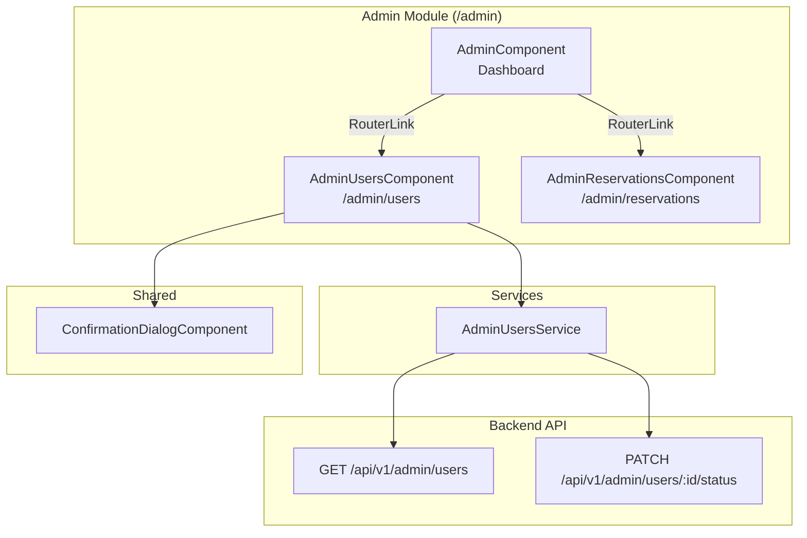
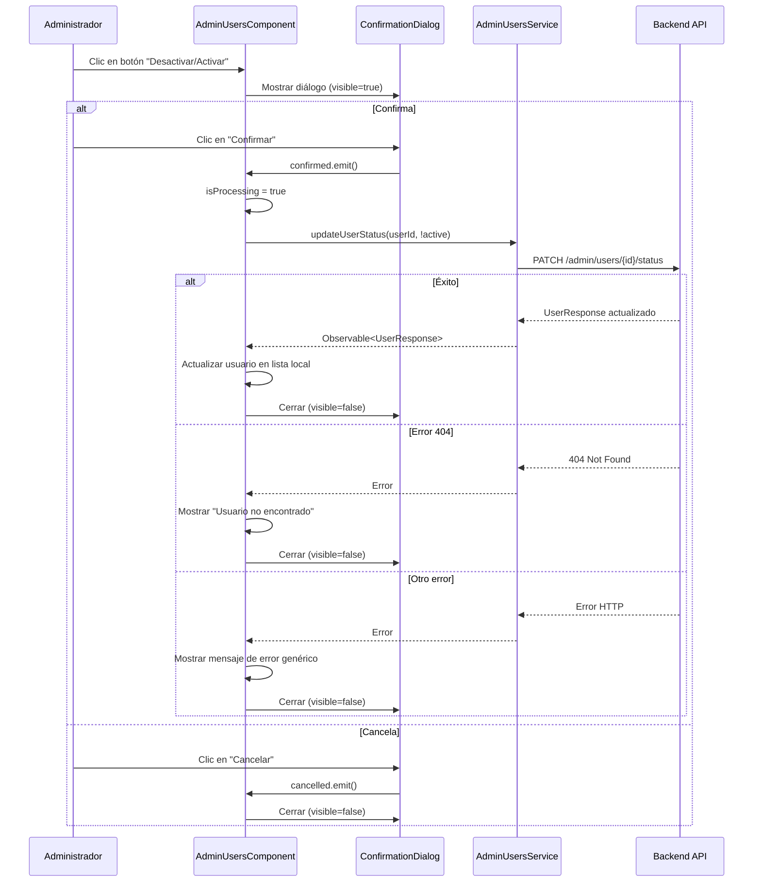

# Documento de Diseño — Módulo de Administración de Usuarios

## Overview

Este documento describe el diseño técnico del **Módulo de Administración de Usuarios** para el frontend Angular de Smart Tourism. El módulo permite a los administradores listar usuarios con paginación y activar/desactivar cuentas mediante un toggle con confirmación.

El diseño sigue los patrones establecidos en el proyecto:
- Componentes standalone con `ChangeDetectionStrategy.OnPush`
- Inyección de dependencias con `inject()`
- Paginación con la interfaz `Page<T>` existente
- Reutilización del `ConfirmationDialogComponent` existente
- Variables CSS del design system para estilos consistentes

**Decisiones clave:**
1. Se crea un servicio dedicado `AdminUsersService` (separado de `ReservationsService`) para mantener responsabilidad única.
2. Se reutiliza la interfaz `Page<T>` existente en `reservation.model.ts` (se moverá a un modelo compartido o se importará directamente).
3. El `AdminComponent` existente se transforma en un dashboard con tarjetas de navegación.
4. Se usa `ConfirmationDialogComponent` existente para la confirmación de cambio de estado.

---

## Architecture

### Diagrama de Componentes



### Diagrama de Flujo — Toggle de Estado



---

## Components and Interfaces

### 1. AdminUsersService

**Ubicación:** `src/app/features/admin/services/admin-users.service.ts`

```typescript
@Injectable({ providedIn: 'root' })
export class AdminUsersService {
  private http = inject(HttpClient);
  private baseUrl = `${environment.apiUrl}/admin/users`;

  getUsers(page: number, size: number): Observable<Page<UserResponse>> { ... }
  updateUserStatus(userId: string, active: boolean): Observable<UserResponse> { ... }
}
```

**Responsabilidades:**
- Encapsular las peticiones HTTP al endpoint `/api/v1/admin/users`
- Construir los parámetros de query para paginación
- Propagar errores HTTP al consumidor sin transformarlos

---

### 2. AdminUsersComponent

**Ubicación:** `src/app/features/admin/admin-users/admin-users.component.ts`

```typescript
@Component({
  selector: 'app-admin-users',
  standalone: true,
  imports: [CommonModule, ConfirmationDialogComponent],
  templateUrl: './admin-users.component.html',
  styleUrl: './admin-users.component.scss',
  changeDetection: ChangeDetectionStrategy.OnPush,
})
export class AdminUsersComponent implements OnInit {
  private adminUsersService = inject(AdminUsersService);
  private cdr = inject(ChangeDetectorRef);

  users: UserResponse[] = [];
  isLoading = false;
  errorMessage = '';
  currentPage = 0;
  totalPages = 0;
  totalElements = 0;
  pageSize = 20;

  // Estado del diálogo de confirmación
  showDialog = false;
  dialogTitle = '';
  dialogMessage = '';
  isProcessing = false;
  selectedUser: UserResponse | null = null;
}
```

**Responsabilidades:**
- Mostrar tabla de usuarios con columnas: nombre, email, teléfono, rol, estado, fecha de creación
- Gestionar paginación (anterior/siguiente)
- Mostrar estados de carga, error y lista vacía
- Gestionar el flujo de toggle de estado con confirmación
- Actualizar el usuario en la lista local tras éxito (sin recargar toda la página)

---

### 3. AdminComponent (Dashboard actualizado)

**Ubicación:** `src/app/features/admin/admin/admin.component.ts` (existente, se modifica)

```typescript
@Component({
  selector: 'app-admin',
  standalone: true,
  imports: [RouterLink],
  templateUrl: './admin.component.html',
  styleUrl: './admin.component.scss',
})
export class AdminComponent {}
```

**Responsabilidades:**
- Mostrar encabezado "Panel de Administración"
- Mostrar tarjetas de navegación a "Gestión de Usuarios" y "Gestión de Reservas"
- Usar `RouterLink` para navegación interna

---

### 4. Configuración de Rutas

**Ubicación:** `src/app/features/admin/admin.routes.ts` (existente, se modifica)

```typescript
export const adminRoutes: Routes = [
  { path: '', component: AdminComponent },
  { path: 'reservations', component: AdminReservationsComponent },
  { path: 'users', component: AdminUsersComponent },  // NUEVA
];
```

---

## Data Models

### UserResponse

**Ubicación:** `src/app/features/admin/models/user-admin.model.ts`

```typescript
import { UserRole } from '../../../core/models/user.model';

export interface UserResponse {
  id: string;
  fullName: string;
  email: string;
  phone: string;
  documentNumber: string;
  role: UserRole;
  active: boolean;
  createdAt: string;   // ISO datetime string
  updatedAt: string;   // ISO datetime string
}

export interface UpdateUserStatusRequest {
  active: boolean;
}
```

**Decisión de diseño:** Se crea una interfaz `UserResponse` específica para el módulo admin en lugar de reutilizar `UserInfo` del core, ya que el endpoint admin devuelve campos adicionales (phone, documentNumber, active, createdAt, updatedAt) que no están en el modelo de autenticación.

### Reutilización de Page<T>

Se importará la interfaz `Page<T>` directamente desde `features/reservations/models/reservation.model.ts` ya que es genérica y reutilizable. En una futura refactorización se podría mover a `core/models/pagination.model.ts`.

```typescript
// Importación existente
import { Page } from '../../reservations/models/reservation.model';
```

---

## Correctness Properties

*Una propiedad es una característica o comportamiento que debe mantenerse verdadero en todas las ejecuciones válidas de un sistema — esencialmente, una declaración formal sobre lo que el sistema debe hacer. Las propiedades sirven como puente entre especificaciones legibles por humanos y garantías de correctitud verificables por máquinas.*

### Property 1: Construcción correcta de URL para getUsers

*Para cualquier* combinación válida de `page` (entero >= 0) y `size` (entero > 0), el método `getUsers(page, size)` del `AdminUsersService` SHALL construir una petición GET cuya URL contenga los parámetros de query `page` y `size` con los valores proporcionados.

**Validates: Requirements 1.1, 9.4**

### Property 2: Construcción correcta de petición PATCH para updateUserStatus

*Para cualquier* `userId` (string no vacío) y valor `active` (booleano), el método `updateUserStatus(userId, active)` del `AdminUsersService` SHALL construir una petición PATCH a la URL que contenga `/admin/users/{userId}/status` con el cuerpo `{ active: <valor> }`.

**Validates: Requirements 1.2, 9.2**

### Property 3: Completitud de renderizado de filas de usuario

*Para cualquier* lista no vacía de objetos `UserResponse`, el `AdminUsersComponent` SHALL renderizar una fila en la tabla por cada usuario, y cada fila SHALL contener el nombre completo (`fullName`), email (`email`), teléfono (`phone`), rol (`role`) y estado (`active`) del usuario correspondiente.

**Validates: Requirements 2.2, 10.4**

### Property 4: Consistencia de UI con el estado activo del usuario

*Para cualquier* usuario en la lista, el botón de acción SHALL mostrar "Desactivar" si `active === true` y "Activar" si `active === false`, y el badge de estado SHALL incluir un `aria-label` con "Estado: Activo" o "Estado: Inactivo" correspondiente al valor de `active`.

**Validates: Requirements 3.1, 6.7**

---

## Error Handling

### Estrategia General

El manejo de errores sigue un patrón consistente en todo el módulo:

| Escenario | Mensaje al usuario | Comportamiento |
|---|---|---|
| Error de red al listar usuarios | "Error al cargar los usuarios. Intenta de nuevo más tarde" | Ocultar indicador de carga, mostrar mensaje con `role="alert"` |
| Error 404 al actualizar estado | "Usuario no encontrado" | Cerrar diálogo, mantener tabla visible |
| Otro error al actualizar estado | "Error al actualizar el estado del usuario. Intenta de nuevo más tarde" | Cerrar diálogo, mantener tabla visible |

### Implementación en el Componente

```typescript
// En AdminUsersComponent
private handleStatusUpdateError(error: HttpErrorResponse): void {
  if (error.status === 404) {
    this.errorMessage = 'Usuario no encontrado';
  } else {
    this.errorMessage = 'Error al actualizar el estado del usuario. Intenta de nuevo más tarde';
  }
  this.showDialog = false;
  this.isProcessing = false;
  this.cdr.markForCheck();
}
```

### Principios de Diseño

1. **Preservación de datos**: Tras un error en actualización de estado, la tabla permanece visible con los datos previamente cargados.
2. **Feedback inmediato**: Los mensajes de error se muestran con `role="alert"` para accesibilidad.
3. **Propagación limpia**: El servicio propaga errores HTTP sin transformarlos; el componente decide cómo presentarlos.
4. **Prevención de doble envío**: `isProcessing=true` durante la petición evita múltiples clics.

---

## Testing Strategy

### Enfoque Dual

El módulo utiliza dos tipos de tests complementarios:

#### Tests Unitarios (example-based)
- Verifican comportamientos específicos con datos concretos
- Cubren estados de UI (carga, error, vacío)
- Cubren interacciones (clic en botones, navegación de páginas)
- Cubren edge cases (error 404, primera/última página)

#### Tests de Propiedad (property-based con fast-check)
- Verifican propiedades universales con datos generados aleatoriamente
- Mínimo **100 iteraciones** por test de propiedad
- Cada test referencia su propiedad del documento de diseño

### Librería PBT: fast-check

Se usa `fast-check` (ya instalado en el proyecto, versión ^3.22.0) para los tests de propiedad.

### Configuración de Tests de Propiedad

```typescript
import fc from 'fast-check';

// Ejemplo de estructura para tests de propiedad
describe('AdminUsersService - Property Tests', () => {
  it('Property 1: URL construction for getUsers', () => {
    // Feature: admin-users-module, Property 1: Construcción correcta de URL para getUsers
    fc.assert(
      fc.property(
        fc.nat(),                    // page >= 0
        fc.integer({ min: 1 }),      // size > 0
        (page, size) => {
          // Verificar que la URL contiene los parámetros correctos
        }
      ),
      { numRuns: 100 }
    );
  });
});
```

### Plan de Tests

| Componente/Servicio | Tipo | Descripción | Propiedad |
|---|---|---|---|
| AdminUsersService | PBT | URL construction getUsers | Propiedad 1 |
| AdminUsersService | PBT | PATCH request construction | Propiedad 2 |
| AdminUsersService | Unit | Error propagation | — |
| AdminUsersService | Unit | Base URL from environment | — |
| AdminUsersComponent | PBT | Rendering completeness | Propiedad 3 |
| AdminUsersComponent | PBT | Active state UI consistency | Propiedad 4 |
| AdminUsersComponent | Unit | Loading indicator | — |
| AdminUsersComponent | Unit | Empty list message | — |
| AdminUsersComponent | Unit | Error message display | — |
| AdminUsersComponent | Unit | Confirmation dialog flow | — |
| AdminUsersComponent | Unit | Pagination controls visibility | — |
| AdminUsersComponent | Unit | Previous button disabled on first page | — |
| AdminUsersComponent | Unit | Next button disabled on last page | — |
| AdminUsersComponent | Unit | Status update success updates table | — |
| AdminUsersComponent | Unit | 404 error shows specific message | — |

### Generadores fast-check

```typescript
// Generador de UserResponse válido
const userResponseArb = fc.record({
  id: fc.uuid(),
  fullName: fc.string({ minLength: 1, maxLength: 100 }),
  email: fc.emailAddress(),
  phone: fc.string({ minLength: 7, maxLength: 15 }),
  documentNumber: fc.string({ minLength: 5, maxLength: 20 }),
  role: fc.constantFrom('TOURIST', 'ADMIN'),
  active: fc.boolean(),
  createdAt: fc.date().map(d => d.toISOString()),
  updatedAt: fc.date().map(d => d.toISOString()),
});

// Generador de lista no vacía de usuarios
const userListArb = fc.array(userResponseArb, { minLength: 1, maxLength: 50 });
```

### Tags de Tests de Propiedad

Cada test de propiedad incluirá un comentario con el formato:
```
// Feature: admin-users-module, Property {N}: {texto de la propiedad}
```

