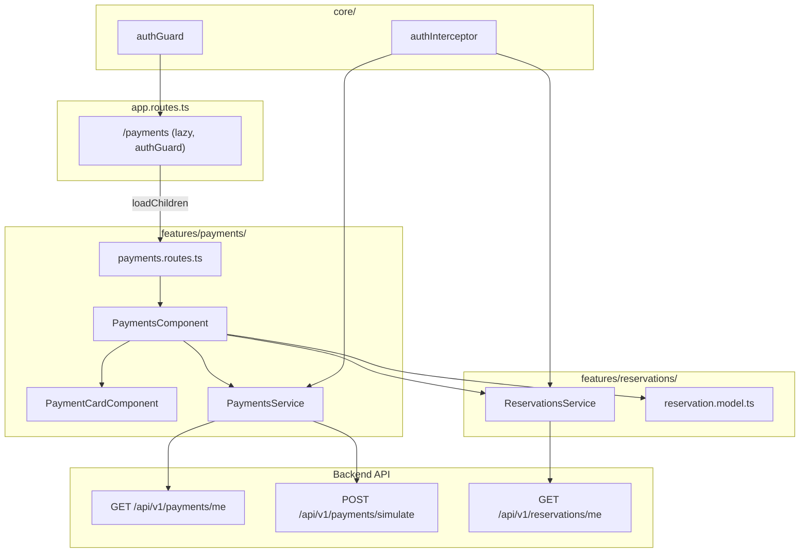
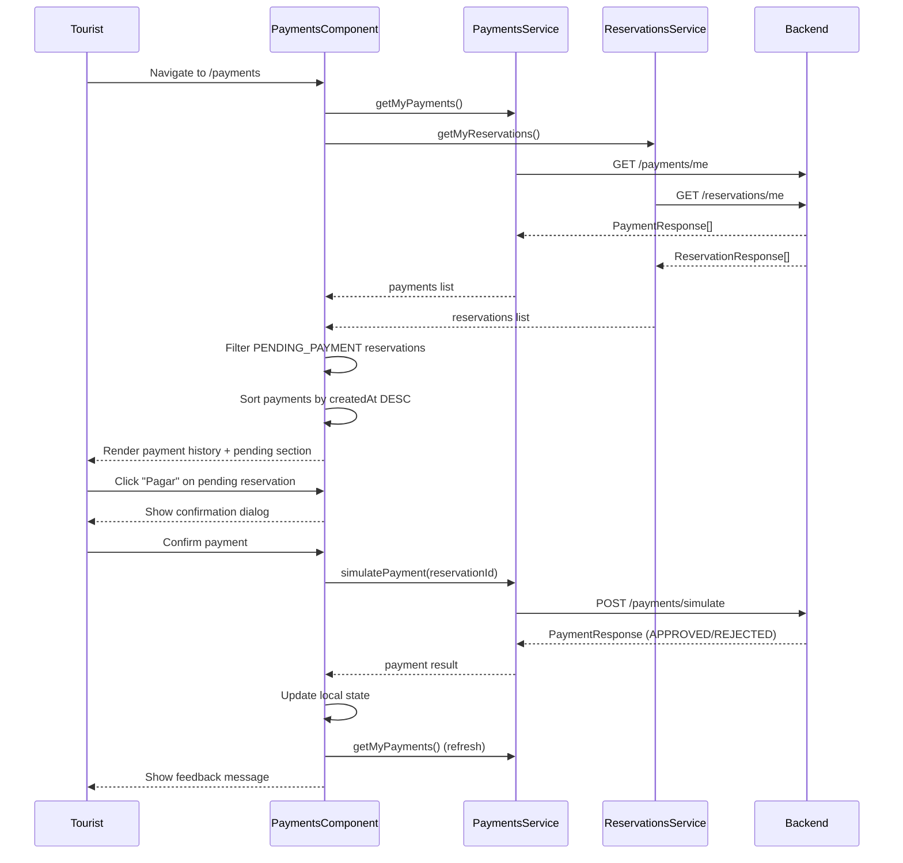

# Design Document: Payments Module

## Overview

The Payments Module provides a dedicated section within the Smart Tourism frontend where authenticated tourists can view their payment history and initiate payments for pending reservations. The module follows the established Angular standalone component architecture, reusing existing patterns from the Reservations feature (card layout, service injection, state management with `ChangeDetectionStrategy.OnPush`).

The module consists of:
- **PaymentsComponent** (Payment_History_View): The main container that orchestrates data fetching, state management, and user interactions.
- **PaymentCardComponent** (Payment_Card): A presentational component rendering individual payment transaction details.
- **PaymentsService**: Extended with a `getMyPayments()` method to fetch payment history from `GET /payments/me`.

The design leverages the existing `PaymentResponse` model, `PaymentsService.simulatePayment()`, and `ReservationsService.getMyReservations()` to provide a unified payment management experience.

## Architecture



### Data Flow



## Components and Interfaces

### PaymentsComponent (Payment_History_View)

**Selector:** `app-payments`
**Location:** `src/app/features/payments/payments/payments.component.ts`
**Change Detection:** `OnPush`

**Responsibilities:**
- Fetch payment history and pending reservations on init
- Manage loading, error, and empty states
- Orchestrate payment simulation flow (dialog → confirm → result)
- Display feedback messages (success/warning/error)

**State:**
```typescript
payments: PaymentResponse[] = [];
pendingReservations: ReservationResponse[] = [];
isLoading = false;
errorMessage = '';
paymentLoading: string | null = null;
confirmPayId: string | null = null;
paymentMessage: string | null = null;
paymentMessageType: 'success' | 'warning' | 'error' | null = null;
```

**Dependencies:**
- `PaymentsService` (inject)
- `ReservationsService` (inject)
- `ChangeDetectorRef` (inject)

### PaymentCardComponent (Payment_Card)

**Selector:** `app-payment-card`
**Location:** `src/app/features/payments/payment-card/payment-card.component.ts`
**Change Detection:** Default (presentational, receives input via `@Input`)

**Responsibilities:**
- Render a single payment transaction in card format
- Format currency as COP (e.g., `$50.000`)
- Format dates (`dd/MM/yyyy HH:mm` for createdAt, `dd/MM/yyyy` for reservationDate)
- Map payment status to localized labels and CSS classes
- Handle null/empty experience title with fallback text

**Inputs:**
```typescript
@Input() payment!: PaymentResponse;
```

**Computed Properties:**
```typescript
get statusLabel(): string;    // APPROVED→"Aprobado", REJECTED→"Rechazado", etc.
get statusClass(): string;    // APPROVED→"status-approved", etc.
get displayTitle(): string;   // fallback to "Experiencia no disponible"
```

### PaymentsService (Extended)

**Location:** `src/app/features/payments/services/payments.service.ts`

**New Method:**
```typescript
getMyPayments(): Observable<PaymentResponse[]> {
  return this.http.get<PaymentResponse[]>(`${this.baseUrl}/me`);
}
```

The existing `simulatePayment()` method remains unchanged. Errors are propagated as-is (the `authInterceptor` handles 401 globally).

## Data Models

The module reuses the existing `PaymentResponse` and `ReservationResponse` interfaces from `features/reservations/models/reservation.model.ts`. No new model definitions are required.

**PaymentResponse** (existing):
```typescript
interface PaymentResponse {
  id: string;
  paymentStatus: PaymentStatus;        // 'PENDING' | 'APPROVED' | 'REJECTED' | 'EXPIRED'
  transactionReference: string;
  amount: number;
  reservationId: string;
  reservationStatus: ReservationStatus;
  touristId: string;
  touristName: string;
  touristEmail: string;
  experienceId: string;
  experienceTitle: string;
  experienceLocation: string;
  reservationDate: string;             // yyyy-MM-dd
  quantity: number;
  totalAmount: number;
  expirationDate: string;              // ISO datetime
  createdAt: string;                   // ISO datetime
}
```

**Status Label Mapping:**
| PaymentStatus | Label (ES) | CSS Class |
|---|---|---|
| APPROVED | Aprobado | `status-approved` |
| REJECTED | Rechazado | `status-rejected` |
| PENDING | Pendiente | `status-pending` |
| EXPIRED | Expirado | `status-expired` |

**COP Currency Formatting:**
- Angular's `CurrencyPipe` with format: `currency:'COP':'symbol-narrow':'1.0-0'`
- Produces output like `$50.000` for value `50000`

## Correctness Properties

*A property is a characteristic or behavior that should hold true across all valid executions of a system — essentially, a formal statement about what the system should do. Properties serve as the bridge between human-readable specifications and machine-verifiable correctness guarantees.*

### Property 1: Payment history is sorted by creation date descending

*For any* non-empty array of PaymentResponse objects with distinct `createdAt` timestamps, after the PaymentsComponent processes and displays them, the rendered order SHALL have each payment's `createdAt` value greater than or equal to the next payment's `createdAt` value (i.e., strictly descending chronological order).

**Validates: Requirements 1.5**

### Property 2: Payment_Card renders all required data fields

*For any* valid PaymentResponse object with non-null experienceTitle, the PaymentCardComponent's rendered output SHALL contain the experienceTitle, transactionReference (full string without truncation), quantity (as integer), and experienceLocation values from the input object.

**Validates: Requirements 2.1, 2.5, 2.8, 2.9, 1.4**

### Property 3: COP currency formatting produces valid Colombian Peso representation

*For any* non-negative integer amount, the formatted currency output SHALL match the pattern of a dollar sign prefix followed by digits grouped with period separators every three digits and no decimal places (e.g., 50000 → "$50.000", 1000000 → "$1.000.000").

**Validates: Requirements 2.2**

### Property 4: Date formatting produces correct patterns

*For any* valid ISO datetime string, formatting with the `dd/MM/yyyy HH:mm` pattern SHALL produce a string matching the regex `\d{2}/\d{2}/\d{4} \d{2}:\d{2}`, and *for any* valid ISO date string, formatting with `dd/MM/yyyy` SHALL produce a string matching `\d{2}/\d{2}/\d{4}`. Furthermore, the day, month, year, hour, and minute components SHALL correspond to the original date values.

**Validates: Requirements 2.6, 2.7**

### Property 5: Payment_Card accessibility label contains title and status

*For any* valid PaymentResponse object, the PaymentCardComponent SHALL render with `role="article"` and an `aria-label` attribute that contains both the experience title (or fallback text) and the localized payment status label.

**Validates: Requirements 7.2**

### Property 6: HTTP error propagation preserves original status code

*For any* HTTP error response with a status code not in {401} (for getMyPayments) or not in {403, 404, 422} (for simulatePayment), the PaymentsService SHALL propagate the error as an Observable error preserving the original HTTP status code.

**Validates: Requirements 4.7, 5.4**

## Error Handling

### Service Layer

| Scenario | HTTP Status | Behavior |
|---|---|---|
| Reservation not found | 404 | Error propagated to component |
| Tourist doesn't own reservation | 403 | Error propagated to component |
| Reservation not payable | 422 | Error propagated to component |
| Authentication expired | 401 | `authInterceptor` removes token, redirects to `/auth/login` |
| Network/server error | 5xx | Error propagated to component |

The `PaymentsService` does NOT transform errors — it relies on the `authInterceptor` for 401 handling and lets the component handle all other errors via the Observable error callback.

### Component Layer

| State | User-Facing Behavior |
|---|---|
| Payment history fetch fails | Display error message with `role="alert"`, show "Reintentar" button |
| Payment simulation fails (HTTP error) | Display "Error al procesar el pago. Intenta de nuevo más tarde." with `role="alert"` |
| Payment REJECTED | Display warning "El pago fue rechazado. Puedes intentarlo de nuevo." |
| Payment APPROVED | Display success "Pago aprobado. Tu reserva está confirmada.", refresh history |

### State Recovery

- **Retry mechanism**: The "Reintentar" button re-invokes `loadPayments()` to recover from transient failures.
- **Optimistic update on APPROVED**: Local reservation status updated to CONFIRMED immediately; payment history refreshed from server.
- **No optimistic update on REJECTED**: Reservation stays in PENDING_PAYMENT, user can retry.

## Testing Strategy

### Unit Tests (Vitest + Angular TestBed)

**PaymentCardComponent:**
- Renders experience title from input
- Displays fallback text "Experiencia no disponible" for null/empty title
- Maps each PaymentStatus to correct localized label (exhaustive: 4 cases)
- Maps each PaymentStatus to correct CSS class (exhaustive: 4 cases)
- Formats amount as COP currency
- Formats createdAt as `dd/MM/yyyy HH:mm`
- Formats reservationDate as `dd/MM/yyyy`
- Displays transaction reference without truncation
- Has `role="article"` with correct `aria-label`

**PaymentsComponent:**
- Shows loading indicator while fetching
- Shows empty state when no payments
- Shows error message with `role="alert"` on fetch failure
- Shows "Reintentar" button on error
- Renders correct number of PaymentCardComponents
- Sorts payments by createdAt descending
- Shows pending reservations section when PENDING_PAYMENT exists
- Hides pending section when no PENDING_PAYMENT reservations
- Opens confirmation dialog on "Pagar" click
- Closes dialog on cancel without HTTP call
- Disables button and shows spinner during payment processing
- Shows success message on APPROVED response
- Shows warning message on REJECTED response
- Shows error message on HTTP failure
- Refreshes payment history after APPROVED payment
- Sets `aria-busy` on main during loading
- Dialog has `role="dialog"` and `aria-modal="true"`

**PaymentsService:**
- `getMyPayments()` sends GET to correct URL
- `getMyPayments()` returns Observable<PaymentResponse[]>
- `simulatePayment()` sends POST with correct body
- Propagates 404, 403, 422 errors correctly
- Propagates other HTTP errors preserving status code

### Property-Based Tests (Vitest + fast-check)

The property-based testing library chosen is **fast-check** (already compatible with Vitest). Each property test runs a minimum of 100 iterations.

**Configuration:**
- Library: `fast-check`
- Runner: Vitest
- Minimum iterations: 100 per property
- Tag format: `Feature: payments-module, Property {N}: {description}`

**Properties to implement:**

1. **Feature: payments-module, Property 1: Payment history sorted descending** — Generate random arrays of PaymentResponse with varying createdAt, verify sort order.
2. **Feature: payments-module, Property 2: Payment_Card renders all required fields** — Generate random PaymentResponse objects, verify all fields present in rendered output.
3. **Feature: payments-module, Property 3: COP currency formatting** — Generate random non-negative integers, verify formatted output matches COP pattern.
4. **Feature: payments-module, Property 4: Date formatting correctness** — Generate random valid dates, verify formatted output matches expected patterns and values.
5. **Feature: payments-module, Property 5: Accessibility label contains title and status** — Generate random PaymentResponse, verify aria-label content.
6. **Feature: payments-module, Property 6: HTTP error propagation** — Generate random HTTP status codes (excluding handled ones), verify propagation.

### Integration Tests

- Route `/payments` renders PaymentsComponent when authenticated
- Route `/payments` redirects to `/auth/login` when unauthenticated
- Lazy loading configuration works correctly
