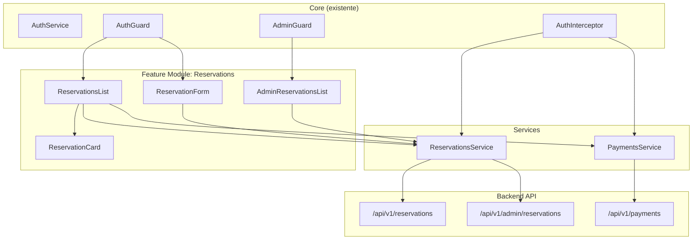

# Design Document: Módulo de Reservas

## Overview

El módulo de reservas es una feature del frontend Angular de Smart Tourism que permite a los turistas autenticados gestionar sus reservas de experiencias turísticas. Incluye la creación de reservas, visualización del historial, simulación de pagos y cancelación. Los administradores tienen acceso a un panel con todas las reservas del sistema con filtros avanzados.

El módulo se integra con el backend Spring Boot existente a través de endpoints REST y sigue los patrones establecidos en el proyecto: standalone components, servicios con `inject()`, reactive forms, y el design system basado en variables CSS.

### Decisiones de Diseño Clave

1. **Servicios por dominio**: Se crean `ReservationsService` y `PaymentsService` separados siguiendo el patrón de `ExperiencesService` existente.
2. **Standalone components**: Todos los componentes son standalone con imports explícitos, consistente con el resto del proyecto.
3. **ChangeDetectionStrategy.OnPush**: Se usa en componentes de listado para optimizar rendimiento, siguiendo el patrón de `ExperiencesComponent`.
4. **Diálogos inline**: Los diálogos de confirmación se implementan como secciones condicionales dentro del componente (no modales externos), siguiendo el patrón de `confirmDeleteId` en `ExperiencesComponent`.
5. **Actualización optimista local**: Tras pago o cancelación exitosa, se actualiza el estado en el array local sin recargar desde el backend.

---

## Architecture



### Estructura de Archivos

```
src/app/features/reservations/
├── models/
│   └── reservation.model.ts          # Interfaces y tipos
├── services/
│   ├── reservations.service.ts        # HTTP service para reservas
│   └── reservations.service.spec.ts   # Tests del servicio
├── reservations/                      # (existente, se refactoriza)
│   ├── reservations.component.ts      # Lista de reservas del turista
│   ├── reservations.component.html
│   ├── reservations.component.scss
│   └── reservations.component.spec.ts
├── reservation-card/
│   ├── reservation-card.component.ts  # Tarjeta individual
│   ├── reservation-card.component.html
│   ├── reservation-card.component.scss
│   └── reservation-card.component.spec.ts
├── reservation-form/
│   ├── reservation-form.component.ts  # Formulario de creación
│   ├── reservation-form.component.html
│   ├── reservation-form.component.scss
│   └── reservation-form.component.spec.ts
├── reservations.routes.ts             # (existente, se actualiza)
└── .gitkeep

src/app/features/payments/
├── services/
│   ├── payments.service.ts            # HTTP service para pagos
│   └── payments.service.spec.ts       # Tests del servicio
└── ...

src/app/features/admin/
├── admin-reservations/
│   ├── admin-reservations.component.ts
│   ├── admin-reservations.component.html
│   ├── admin-reservations.component.scss
│   └── admin-reservations.component.spec.ts
└── admin.routes.ts                    # (existente, se actualiza)
```

---

## Components and Interfaces

### ReservationsService

```typescript
@Injectable({ providedIn: 'root' })
export class ReservationsService {
  private http = inject(HttpClient);
  private baseUrl = `${environment.apiUrl}/reservations`;
  private adminUrl = `${environment.apiUrl}/admin/reservations`;

  createReservation(request: ReservationRequest): Observable<ReservationResponse>;
  getMyReservations(): Observable<ReservationResponse[]>;
  cancelReservation(id: string): Observable<void>;
  getAdminReservations(filters: AdminReservationFilters, page: number, size: number): Observable<Page<ReservationResponse>>;
}
```

### PaymentsService

```typescript
@Injectable({ providedIn: 'root' })
export class PaymentsService {
  private http = inject(HttpClient);
  private baseUrl = `${environment.apiUrl}/payments`;

  simulatePayment(reservationId: string): Observable<PaymentResponse>;
}
```

### ReservationsComponent (Lista del Turista)

```typescript
@Component({
  selector: 'app-reservations',
  standalone: true,
  imports: [CommonModule, RouterLink, ReservationCardComponent],
  changeDetection: ChangeDetectionStrategy.OnPush,
})
export class ReservationsComponent implements OnInit {
  reservations: ReservationResponse[] = [];
  isLoading = false;
  errorMessage = '';
  confirmPayId: string | null = null;
  confirmCancelId: string | null = null;
  paymentLoading: string | null = null;
  cancelLoading: string | null = null;

  // Métodos: loadReservations(), onPay(id), onConfirmPay(),
  //          onCancel(id), onConfirmCancel(), onDismissDialog()
}
```

### ReservationCardComponent

```typescript
@Component({
  selector: 'app-reservation-card',
  standalone: true,
  imports: [CommonModule, CurrencyPipe, DatePipe],
})
export class ReservationCardComponent {
  @Input() reservation!: ReservationResponse;
  @Input() paymentLoading = false;
  @Input() cancelLoading = false;
  @Output() pay = new EventEmitter<string>();
  @Output() cancel = new EventEmitter<string>();
}
```

### ReservationFormComponent

```typescript
@Component({
  selector: 'app-reservation-form',
  standalone: true,
  imports: [CommonModule, ReactiveFormsModule],
  changeDetection: ChangeDetectionStrategy.OnPush,
})
export class ReservationFormComponent implements OnInit {
  form!: FormGroup;
  experienceId = '';
  scheduleId = '';
  isSubmitting = false;
  errorMessage = '';
  experienceTitle = '';
  scheduleInfo = '';
  unitPrice = 0;

  // Métodos: ngOnInit(), onSubmit()
}
```

### AdminReservationsComponent

```typescript
@Component({
  selector: 'app-admin-reservations',
  standalone: true,
  imports: [CommonModule, FormsModule],
  changeDetection: ChangeDetectionStrategy.OnPush,
})
export class AdminReservationsComponent implements OnInit {
  reservations: ReservationResponse[] = [];
  isLoading = false;
  errorMessage = '';
  currentPage = 0;
  totalPages = 0;
  totalElements = 0;
  pageSize = 20;
  filters: AdminReservationFilters = {};

  // Métodos: loadReservations(), onFilterChange(), onNextPage(), onPrevPage()
}
```

---

## Data Models

```typescript
// ─── Enums ────────────────────────────────────────────────────────────────────

export type ReservationStatus =
  | 'PENDING_PAYMENT'
  | 'CONFIRMED'
  | 'CANCELLED'
  | 'EXPIRED'
  | 'NO_SHOW';

export type PaymentStatus = 'PENDING' | 'APPROVED' | 'REJECTED' | 'EXPIRED';

// ─── Request DTOs ─────────────────────────────────────────────────────────────

export interface ReservationRequest {
  experienceId: string;
  scheduleId: string;
  reservationDate: string;  // formato ISO: yyyy-MM-dd
  quantity: number;
}

// ─── Response DTOs ────────────────────────────────────────────────────────────

export interface ReservationResponse {
  id: string;
  touristId: string;
  touristName: string;
  touristEmail: string;
  experienceId: string;
  experienceTitle: string;
  experienceLocation: string;
  scheduleId: string;
  reservationDate: string;      // yyyy-MM-dd
  quantity: number;
  totalAmount: number;
  status: ReservationStatus;
  expirationDate: string;       // ISO datetime
  createdAt: string;            // ISO datetime
  updatedAt: string;            // ISO datetime
}

export interface PaymentResponse {
  id: string;
  paymentStatus: PaymentStatus;
  transactionReference: string;
  amount: number;
  reservationId: string;
  reservationStatus: ReservationStatus;
  touristId: string;
  touristName: string;
  touristEmail: string;
  experienceId: string;
  experienceTitle: string;
  experienceLocation: string;
  reservationDate: string;
  quantity: number;
  totalAmount: number;
  expirationDate: string;
  createdAt: string;
}

// ─── Filtros Admin ────────────────────────────────────────────────────────────

export interface AdminReservationFilters {
  status?: ReservationStatus | null;
  experienceId?: string | null;
  startDate?: string | null;    // yyyy-MM-dd
  endDate?: string | null;      // yyyy-MM-dd
}

// ─── Paginación (reutiliza la interfaz existente de experiences) ──────────────

export interface Page<T> {
  content: T[];
  totalElements: number;
  totalPages: number;
  number: number;
  size: number;
}
```

---

## Correctness Properties

*A property is a characteristic or behavior that should hold true across all valid executions of a system — essentially, a formal statement about what the system should do. Properties serve as the bridge between human-readable specifications and machine-verifiable correctness guarantees.*

### Property 1: Completitud del request body de reserva

*For any* valid `ReservationRequest` with fields `experienceId`, `scheduleId`, `reservationDate`, and `quantity`, when `createReservation(request)` is called, the HTTP POST body SHALL contain exactly those four fields with their original values.

**Validates: Requirements 1.1, 12.4**

### Property 2: Completitud de renderizado de reservas

*For any* non-empty array of `ReservationResponse` objects returned by the backend, the `ReservationsComponent` SHALL render exactly one `app-reservation-card` element per reservation in the array.

**Validates: Requirements 3.2, 14.6**

### Property 3: Formato de monto en COP

*For any* positive numeric `totalAmount`, the `ReservationCardComponent` SHALL display the value formatted as a valid Colombian Peso string (containing the numeric value with thousands separators).

**Validates: Requirements 4.5, 15.5**

### Property 4: Visibilidad de botones de acción según estado

*For any* `ReservationStatus` value, the `ReservationCardComponent` SHALL show the "Pagar" button if and only if the status is `PENDING_PAYMENT`, and SHALL show the "Cancelar" button if and only if the status is `PENDING_PAYMENT` or `CONFIRMED`.

**Validates: Requirements 4.7, 4.9, 15.2, 15.3, 15.4**

### Property 5: Validación del formulario de reserva

*For any* date value in the past, the `ReservationFormComponent` SHALL mark the `reservationDate` field as invalid; and *for any* numeric value less than 1, the form SHALL mark the `quantity` field as invalid.

**Validates: Requirements 5.2, 5.3**

### Property 6: Construcción de request de filtros admin

*For any* combination of `AdminReservationFilters` where some fields are non-null and others are null/undefined, the `ReservationsService.getAdminReservations()` method SHALL include only the non-null filter values as query parameters in the HTTP GET request, along with the pagination parameters.

**Validates: Requirements 8.4**

---

## Error Handling

| Escenario | Componente | Comportamiento |
|-----------|-----------|----------------|
| Error HTTP al cargar reservas del turista | ReservationsComponent | Muestra "Error al cargar tus reservas. Intenta de nuevo más tarde" |
| Error HTTP al cargar reservas admin | AdminReservationsComponent | Muestra "Error al cargar las reservas. Intenta de nuevo más tarde" |
| Error HTTP al crear reserva | ReservationFormComponent | Muestra mensaje descriptivo del error, mantiene datos del formulario |
| Error HTTP al simular pago | ReservationsComponent | Muestra "Error al procesar el pago. Intenta de nuevo más tarde." |
| Error HTTP al cancelar reserva | ReservationsComponent | Muestra "Error al cancelar la reserva. Intenta de nuevo más tarde." |
| Pago rechazado (no es error HTTP) | ReservationsComponent | Muestra "El pago fue rechazado. Puedes intentarlo de nuevo." |

### Estrategia General de Errores

- Los servicios (`ReservationsService`, `PaymentsService`) **propagan** los errores HTTP sin transformarlos.
- Los componentes capturan errores en el callback `error` del `subscribe()` y actualizan una variable `errorMessage`.
- Los mensajes de error se muestran en un `<div class="error-message">` con `color: var(--color-error)`.
- Los estados de carga (`isLoading`, `paymentLoading`, `cancelLoading`) se resetean a `false` en ambos callbacks (`next` y `error`).

---

## Testing Strategy

### Framework y Herramientas

- **Test runner**: Vitest (configurado en el proyecto)
- **Property-based testing**: fast-check v3.22+ (ya instalado)
- **HTTP testing**: `provideHttpClientTesting` + `HttpTestingController` de Angular
- **Component testing**: `TestBed` con standalone components

### Tests Unitarios (Example-Based)

Cada servicio y componente tendrá tests unitarios que verifican:
- Servicios: URLs correctas, métodos HTTP correctos, propagación de errores
- Componentes: estados de carga, mensajes de error, estados vacíos, interacciones de usuario
- Formulario: validaciones, envío, pre-población desde query params

### Tests de Propiedad (Property-Based)

Se usará **fast-check** para implementar las 6 correctness properties definidas arriba. Cada test de propiedad:
- Ejecuta un mínimo de **100 iteraciones**
- Incluye un comentario con el tag: `Feature: reservations-module, Property {N}: {descripción}`
- Genera datos aleatorios representativos del dominio (UUIDs, fechas, montos, estados)

**Configuración de fast-check:**
```typescript
import fc from 'fast-check';

// Arbitraries reutilizables
const arbReservationStatus = fc.constantFrom(
  'PENDING_PAYMENT', 'CONFIRMED', 'CANCELLED', 'EXPIRED', 'NO_SHOW'
);

const arbReservationRequest = fc.record({
  experienceId: fc.uuid(),
  scheduleId: fc.uuid(),
  reservationDate: fc.date({ min: new Date() }).map(d => d.toISOString().split('T')[0]),
  quantity: fc.integer({ min: 1, max: 50 }),
});

const arbReservationResponse = fc.record({
  id: fc.uuid(),
  touristId: fc.uuid(),
  touristName: fc.string({ minLength: 1, maxLength: 50 }),
  touristEmail: fc.emailAddress(),
  experienceId: fc.uuid(),
  experienceTitle: fc.string({ minLength: 1, maxLength: 100 }),
  experienceLocation: fc.string({ minLength: 1, maxLength: 100 }),
  scheduleId: fc.uuid(),
  reservationDate: fc.date().map(d => d.toISOString().split('T')[0]),
  quantity: fc.integer({ min: 1, max: 50 }),
  totalAmount: fc.integer({ min: 1000, max: 10000000 }),
  status: arbReservationStatus,
  expirationDate: fc.date().map(d => d.toISOString()),
  createdAt: fc.date().map(d => d.toISOString()),
  updatedAt: fc.date().map(d => d.toISOString()),
});
```

### Distribución de Tests por Propiedad

| Propiedad | Archivo de Test | Qué genera | Qué verifica |
|-----------|----------------|------------|--------------|
| P1: Completitud request body | `reservations.service.spec.ts` | `ReservationRequest` aleatorios | POST body === request |
| P2: Completitud renderizado | `reservations.component.spec.ts` | Arrays de `ReservationResponse` | DOM cards count === array length |
| P3: Formato COP | `reservation-card.component.spec.ts` | `totalAmount` positivos | String contiene valor numérico formateado |
| P4: Botones por estado | `reservation-card.component.spec.ts` | `ReservationStatus` aleatorios | Presencia/ausencia de botones |
| P5: Validación formulario | `reservation-form.component.spec.ts` | Fechas pasadas y cantidades < 1 | Campo marcado como inválido |
| P6: Filtros admin | `reservations.service.spec.ts` | `AdminReservationFilters` aleatorios | Query params === filtros no nulos |
