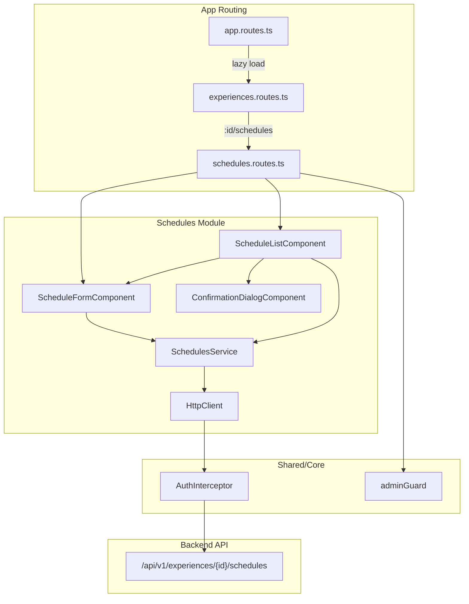

# Design Document: Schedules Module

## Overview

The Schedules Module is an Angular frontend feature that provides ADMIN users with a complete CRUD interface for managing schedules (horarios) associated with tourism experiences. It integrates with the existing backend REST API at `/api/v1/experiences/{experienceId}/schedules` and follows the project's established patterns: standalone components, OnPush change detection, reactive forms, and service-based HTTP communication.

The module is accessed from the experience detail view and is scoped to a single experience via route parameters. It provides schedule listing with sorting, creation/editing via a shared reactive form component, and deactivation with confirmation dialog.

## Architecture



The module follows the same architectural pattern as the existing `experiences` feature:
- **Feature folder**: `src/app/features/experiences/schedules/`
- **Lazy-loaded routes**: Nested under the experience routes as `:id/schedules`
- **Standalone components**: No NgModule, each component declares its own imports
- **OnPush change detection**: All components use `ChangeDetectionStrategy.OnPush`
- **Service layer**: Dedicated `SchedulesService` encapsulates HTTP calls

### Design Decisions

1. **Nested under experiences feature**: Schedules are always scoped to an experience, so the module lives inside `features/experiences/schedules/` rather than as a top-level feature. This mirrors the API URL structure.

2. **Shared form component for create/edit**: A single `ScheduleFormComponent` handles both creation and editing, determined by the presence of a schedule ID in the route. This follows the existing `ExperienceFormComponent` pattern.

3. **Schedules fetched via experience detail**: The backend does not expose a standalone GET endpoint for schedules — they come as part of the `ExperienceResponse`. The `SchedulesService` will call the experience detail endpoint to retrieve schedules, then extract the `schedules` array.

4. **Confirmation dialog as shared component**: The `ConfirmationDialogComponent` is placed in `shared/components/` since it's a reusable pattern that other features may need.

## Components and Interfaces

### ScheduleListComponent

**Selector**: `app-schedule-list`
**Path**: `src/app/features/experiences/schedules/schedule-list/`

Responsibilities:
- Fetches and displays all schedules for the current experience
- Sorts schedules by day of week (MONDAY→SUNDAY) then by start time ascending
- Manages loading, error, and empty states
- Provides actions to create, edit, and delete schedules
- Handles optimistic UI updates after successful CRUD operations

**Inputs**: None (reads `experienceId` from route params)
**State**:
- `schedules: ScheduleResponse[]`
- `isLoading: boolean`
- `errorMessage: string`
- `experienceId: string`

### ScheduleFormComponent

**Selector**: `app-schedule-form`
**Path**: `src/app/features/experiences/schedules/schedule-form/`

Responsibilities:
- Provides reactive form for creating and editing schedules
- Validates all fields (required, time range, slots range)
- Handles form submission and API communication
- Displays backend validation errors
- Manages submission state to prevent duplicates

**State**:
- `form: FormGroup`
- `mode: 'create' | 'edit'`
- `scheduleId: string | null`
- `experienceId: string`
- `isSubmitting: boolean`
- `isLoading: boolean`
- `errorMessage: string`

### ConfirmationDialogComponent

**Selector**: `app-confirmation-dialog`
**Path**: `src/app/shared/components/confirmation-dialog/`

Responsibilities:
- Displays a modal confirmation dialog with customizable message
- Emits confirm/cancel events
- Can be disabled during async operations

**Inputs**:
- `visible: boolean`
- `title: string`
- `message: string`
- `confirmLabel: string`
- `isProcessing: boolean`

**Outputs**:
- `confirmed: EventEmitter<void>`
- `cancelled: EventEmitter<void>`

### SchedulesService

**Path**: `src/app/features/experiences/schedules/services/schedules.service.ts`

```typescript
@Injectable({ providedIn: 'root' })
export class SchedulesService {
  private http = inject(HttpClient);
  private baseUrl = environment.apiUrl;

  getSchedules(experienceId: string): Observable<ScheduleResponse[]>;
  createSchedule(experienceId: string, request: ScheduleRequest): Observable<ScheduleResponse>;
  updateSchedule(experienceId: string, scheduleId: string, request: ScheduleRequest): Observable<ScheduleResponse>;
  deleteSchedule(experienceId: string, scheduleId: string): Observable<void>;
}
```

## Data Models

### ScheduleRequest (frontend model)

```typescript
// src/app/features/experiences/schedules/models/schedule.model.ts

export type DayOfWeek = 'MONDAY' | 'TUESDAY' | 'WEDNESDAY' | 'THURSDAY' | 'FRIDAY' | 'SATURDAY' | 'SUNDAY';

export const DAYS_OF_WEEK: DayOfWeek[] = [
  'MONDAY', 'TUESDAY', 'WEDNESDAY', 'THURSDAY', 'FRIDAY', 'SATURDAY', 'SUNDAY'
];

export interface ScheduleRequest {
  dayOfWeek: DayOfWeek;
  startTime: string;   // HH:mm format
  endTime: string;     // HH:mm format
  availableSlots: number;
}

export interface ScheduleResponse {
  id: string;
  dayOfWeek: DayOfWeek;
  startTime: string;   // HH:mm format
  endTime: string;     // HH:mm format
  availableSlots: number;
}
```

### Sorting Logic

The `DAYS_OF_WEEK` array defines the canonical ordering. Schedules are sorted by:
1. Index of `dayOfWeek` in `DAYS_OF_WEEK` (ascending)
2. `startTime` string comparison (ascending) — works correctly for HH:mm 24-hour format

### Form Validation Rules

| Field | Validators |
|-------|-----------|
| dayOfWeek | Required, must be one of `DAYS_OF_WEEK` |
| startTime | Required, HH:mm format |
| endTime | Required, HH:mm format, must be > startTime (cross-field) |
| availableSlots | Required, integer, min 1, max 1000 |

### Route Structure

```
/experiences/:id/schedules          → ScheduleListComponent
/experiences/:id/schedules/new      → ScheduleFormComponent (create)
/experiences/:id/schedules/:scheduleId/edit → ScheduleFormComponent (edit)
```

All routes protected by `authGuard` (inherited) + `adminGuard`.

## Correctness Properties

*A property is a characteristic or behavior that should hold true across all valid executions of a system — essentially, a formal statement about what the system should do. Properties serve as the bridge between human-readable specifications and machine-verifiable correctness guarantees.*

### Property 1: Schedule sorting preserves day-of-week then time ordering

*For any* array of ScheduleResponse objects with arbitrary day-of-week and start-time values, after applying the sort function, the resulting array SHALL be ordered such that for any two adjacent elements, the first element's day-of-week index is less than or equal to the second's, and when equal, the first element's start time is less than or equal to the second's.

**Validates: Requirements 1.1**

### Property 2: Time range validation correctness

*For any* pair of time strings in HH:mm format, the cross-field validator SHALL return an error if and only if the end time is less than or equal to the start time (comparing as time values within the same day).

**Validates: Requirements 2.3, 3.2, 5.5**

### Property 3: Available slots range validation correctness

*For any* numeric value, the available slots validator SHALL accept the value if and only if it is an integer and falls within the range [1, 1000] inclusive.

**Validates: Requirements 2.4, 3.2, 5.4**

### Property 4: Service URL construction correctness

*For any* valid experience ID string and optional schedule ID string, the SchedulesService SHALL construct a URL that equals `${environment.apiUrl}/experiences/${experienceId}/schedules` for list/create operations, and `${environment.apiUrl}/experiences/${experienceId}/schedules/${scheduleId}` for update/delete operations.

**Validates: Requirements 7.7**

## Error Handling

### HTTP Error Categories

| HTTP Status | Context | User-Facing Behavior |
|-------------|---------|---------------------|
| 400 | Create/Edit | Display backend validation message adjacent to form |
| 404 (experience) | Navigation | Redirect to `/experiences` |
| 404 (schedule) | Edit/Delete | Display "schedule no longer exists" message |
| 500 / Network | Any operation | Display generic retry message |

### Error Flow

1. **Service layer**: Propagates errors unchanged (no `catchError` in service)
2. **Component layer**: Subscribes to error callback, sets `errorMessage`, calls `cdr.markForCheck()`
3. **Template layer**: Conditionally renders error messages based on `errorMessage` state

### Loading States

- **List loading**: Spinner replaces list content while fetching
- **Form submission**: Submit button disabled + spinner indicator
- **Dialog processing**: Both confirm and cancel buttons disabled

## Testing Strategy

### Unit Tests (Vitest)

- **SchedulesService**: Mock `HttpClient` via `HttpClientTestingModule`, verify correct URLs, methods, and payloads for each operation
- **ScheduleListComponent**: Test loading/error/empty states, verify sorting output, test delete flow with confirmation
- **ScheduleFormComponent**: Test form initialization (create vs edit), validation states, submission flow, error display
- **ConfirmationDialogComponent**: Test visibility, event emission, disabled state
- **Validators**: Test custom validators with specific edge cases (boundary values, invalid formats)

### Property-Based Tests (fast-check + Vitest)

The project already includes `fast-check` as a dev dependency. Property tests will validate the universal correctness properties defined above.

**Configuration**:
- Minimum 100 iterations per property test
- Each test tagged with: `Feature: schedules-module, Property {number}: {description}`

**Test targets**:
- `sortSchedules()` pure function — Property 1
- `timeRangeValidator()` custom validator — Property 2
- `availableSlotsValidator()` / Validators config — Property 3
- `SchedulesService` URL construction — Property 4

### Integration Tests

- Route guard behavior (admin vs non-admin access)
- Full create/edit/delete flow with mocked HTTP responses
- Navigation from experience detail to schedule management

### Test File Locations

```
src/app/features/experiences/schedules/services/schedules.service.spec.ts
src/app/features/experiences/schedules/schedule-list/schedule-list.component.spec.ts
src/app/features/experiences/schedules/schedule-form/schedule-form.component.spec.ts
src/app/features/experiences/schedules/validators/schedule-validators.spec.ts
src/app/shared/components/confirmation-dialog/confirmation-dialog.component.spec.ts
```
